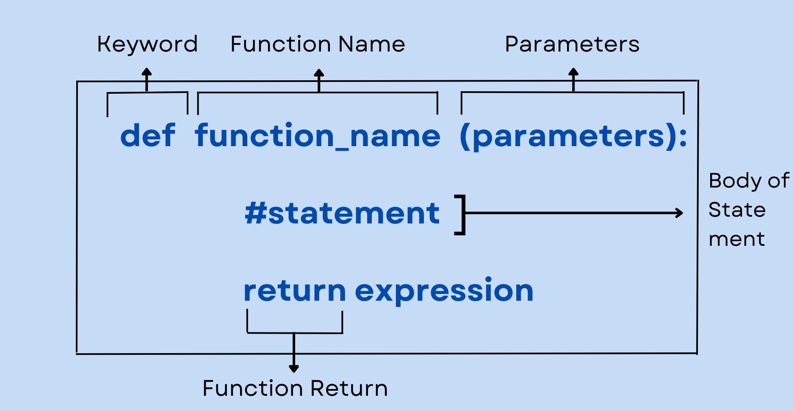
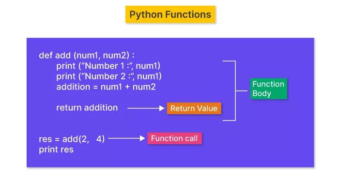

## **Function in Python**

In Python, a **function** is a reusable block of code that performs a specific task. Functions help make the code more modular, readable, and efficient.  

---

### **1. What is a Function?**  
A function is a **named block of code** that runs only when it is called. It can take inputs (parameters) and return an output (result).  

### Function structure



----
### **Syntax of a Function:**
```python
def function_name(parameters):
    """Docstring: Description of the function"""
    # Function body
    return result
```
---


- **`def`**: This keyword is used to define a function.  
- **`function_name`**: A unique name to identify the function.  
- **`parameters`**: Values (arguments) that the function takes as input (optional).  
- **`"""Docstring"""`**: A short description of the function (optional but recommended).  
- **Function Body**: Contains the logic or code that executes when the function is called.  
- **`return`**: This keyword is used to return a value from the function (optional).  

---

## **2. Types of Functions in Python**
Python has **two types of functions**:  
1. **Built-in Functions**: Functions that come with Python (e.g., `print()`, `len()`, `max()`).  
2. **User-defined Functions**: Functions created by the programmer to perform specific tasks.

---

## **3. Creating and Calling a Function**
### **Example: Simple Function Without Parameters**
```python
def greet():
    """This function prints a greeting message."""
    print("Hello! Welcome to Python.")

# Calling the function
greet()
```
### **Output:**
```
Hello! Welcome to Python.
```

---

## **4. Function with Parameters**
Parameters allow functions to accept inputs and work with different values.

### **Example: Function with One Parameter**
```python
def greet(name):
    """This function prints a greeting with a name."""
    print(f"Hello, {name}! Welcome to Python.")

# Calling the function
greet("Alice")
greet("Bob")
```
### **Output:**
```
Hello, Alice! Welcome to Python.
Hello, Bob! Welcome to Python.
```

---

## **5. Function with Multiple Parameters**
A function can take multiple parameters separated by commas.

### **Example: Function with Two Parameters**
```python
def add_numbers(a, b):
    """This function adds two numbers and returns the result."""
    return a + b

# Calling the function
result = add_numbers(10, 20)
print("Sum:", result)
```
### **Output:**
```
Sum: 30
```

---

## **6. Function with Default Parameter Value**
If a parameter is not provided, the default value is used.

### **Example:**
```python
def greet(name="Guest"):
    """This function greets a user with a default name."""
    print(f"Hello, {name}!")

# Calling the function
greet("Alice")  # Uses provided argument
greet()         # Uses default value
```
### **Output:**
```
Hello, Alice!
Hello, Guest!
```

---

## **7. Function with Return Statement**
A function can return a value using the `return` keyword.

### **Example:**
```python
def square(num):
    """This function returns the square of a number."""
    return num * num

# Calling the function
result = square(5)
print("Square:", result)
```
### **Output:**
```
Square: 25
```

---

## **8. Function with Arbitrary Arguments (`*args`)**
If the number of arguments is unknown, use `*args` to accept multiple values.

### **Example:**
```python
def sum_numbers(*numbers):
    """This function returns the sum of multiple numbers."""
    return sum(numbers)

# Calling the function
print(sum_numbers(1, 2, 3, 4, 5))  # Output: 15
```

---

## **9. Function with Keyword Arguments (`**kwargs`)**
If you want to pass named arguments as key-value pairs, use `**kwargs`.

### **Example:**
```python
def display_info(**info):
    """This function prints key-value pairs of information."""
    for key, value in info.items():
        print(f"{key}: {value}")

# Calling the function
display_info(name="Alice", age=25, city="New York")
```
### **Output:**
```
name: Alice
age: 25
city: New York
```

---

## **10. Lambda (Anonymous) Functions**
A **lambda function** is a small anonymous function defined using the `lambda` keyword.

### **Example:**
```python
# Lambda function to find square
square = lambda x: x * x

print(square(5))  # Output: 25
```

---

## **11. Recursion (Function Calling Itself)**
A function can call itself to solve problems like calculating the factorial of a number.

### **Example: Factorial using Recursion**
```python
def factorial(n):
    """This function calculates factorial recursively."""
    if n == 0 or n == 1:
        return 1
    else:
        return n * factorial(n - 1)

# Calling the function
print(factorial(5))  # Output: 120
```

---

## **12. Function Scope (Local & Global Variables)**
- **Local Variable**: Defined inside a function and accessible only within that function.
- **Global Variable**: Defined outside a function and accessible throughout the program.

### **Example:**
```python
x = 10  # Global variable

def my_function():
    x = 5  # Local variable
    print("Inside function:", x)

my_function()
print("Outside function:", x)
```
### **Output:**
```
Inside function: 5
Outside function: 10
```

---

## **13. Passing Functions as Arguments**
Functions can be passed as arguments to other functions.

### **Example:**
```python
def double(n):
    return n * 2

def apply_function(func, value):
    return func(value)

# Passing function as argument
print(apply_function(double, 10))  # Output: 20
```

---

## **14. Nested Functions**
Functions can be defined inside other functions.

### **Example:**
```python
def outer_function():
    def inner_function():
        print("Hello from Inner Function!")
    inner_function()

outer_function()
```
### **Output:**
```
Hello from Inner Function!
```

---

## **15. Function Decorators**
A **decorator** is a function that modifies another function’s behavior.

### **Example:**
```python
def decorator(func):
    def wrapper():
        print("Before function call")
        func()
        print("After function call")
    return wrapper

@decorator
def say_hello():
    print("Hello!")

say_hello()
```
### **Output:**
```
Before function call
Hello!
After function call
```

---

## Practice Question

###  **Basic Level**

1. **Sum of Two Numbers**
   ( Ek function likho `add_numbers(a, b)` jo do numbers ka sum return kare.)

2. **Factorial Finder**
   ( Ek function likho `factorial(n)` jo given number ka factorial return kare. (e.g., 5 → 120) )

3. **Even or Odd Checker**
   ( Ek function likho `check_even_odd(num)` jo check kare number even hai ya odd, aur uske according print kare. )

4. **Palindrome Checker**
   ( Ek function likho `is_palindrome(string)` jo check kare ki given string palindrome hai ya nahi. (e.g., “madam” → True) )

5. **Maximum of Three Numbers**
   ( Ek function likho `max_of_three(a, b, c)` jo teeno numbers me se sabse bada number return kare. )

---

###  **Intermediate Level**

6. **Fibonacci Series Generator**
   ( Ek function likho `fibonacci(n)` jo first `n` terms of Fibonacci series print kare. )

7. **Count Vowels**
   ( Ek function likho `count_vowels(text)` jo given string me total vowels (a, e, i, o, u) count kare aur return kare. )

8. **Prime Number Checker**
   ( Ek function likho `is_prime(num)` jo check kare ki number prime hai ya nahi. )

9. **Reverse a String (without using slicing)**
   ( Ek function likho `reverse_string(text)` jo string ko reverse karke return kare — slicing (`[::-1]`) ka use nahi karna. )

10. **List Sum using Recursion**
    ( Ek recursive function likho `recursive_sum(lst)` jo list ke sare elements ka sum return kare bina loop ke. )
