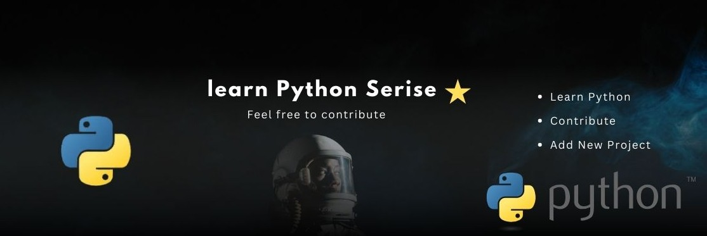

# Learn Python Language
  
   

> [!TIP]
> Welcome to [**Learn Python Language**](https://github.com/codewithdhruba01/Learn-python-language) Read, Practice, Code!

---

This repository is part of **My Python learning journey,** created to help beginners understand Python from the ground up. Whether you're just starting or revising core concepts, this repo is packed with helpful examples, exercises, and mini-projects.

🧠 **Inspired by continuous practice and real-world application.**

## What You'll Learn

| Sr. | Topic | Link |
|-----|-------|------|
| 0   | Python Setup & Installation | [View](https://github.com/codewithdhruba01/Learn-python-language/tree/master/00_Setup%26installation) |
| 1   | Introduction to Python | [View](https://github.com/codewithdhruba01/Learn-python-language/tree/master/01_Introduction) |
| 2   | Operators in Python | [View](https://github.com/codewithdhruba01/Learn-python-language/tree/master/02_Operator) |
| 3   | Variables & Data Types | [View](https://github.com/codewithdhruba01/Learn-python-language/tree/master/03_Variable_DataType) |
| 4   | String in Python | [View](https://github.com/codewithdhruba01/Learn-python-language/tree/master/04_String) |
| 5   | Lists in Python | [View](https://github.com/codewithdhruba01/Learn-python-language/tree/master/05_Lists) |
| 6   | Tuples in Python | [View](https://github.com/codewithdhruba01/Learn-python-language/tree/master/06_Tuples) |
| 7   | Set in Python | [View](https://github.com/codewithdhruba01/Learn-python-language/tree/master/07_Sets) |
| 8   | Dictionary in Python | [View](https://github.com/codewithdhruba01/Learn-python-language/tree/master/08_Dictionary) |
| 9   | Conditional Statements in Python | [View](https://github.com/codewithdhruba01/Learn-python-language/tree/master/09_Conditional_Statements) |
| 10  | Loops in Python | [View](https://github.com/codewithdhruba01/Learn-python-language/tree/master/10_Loops) |
| 11  | Function in Python | [View](https://github.com/codewithdhruba01/Learn-python-language/tree/master/11_Functions) |
| 12  | Recursion in Python | [View](https://github.com/codewithdhruba01/Learn-python-language/tree/master/12_Recursion) |
| 13  | File Input and Output (I/O) in Python | [View](https://github.com/codewithdhruba01/Learn-python-language/tree/master/13_File_InputOutput) |
| 14  | OOPS in Python | [View](https://github.com/codewithdhruba01/Learn-python-language/tree/master/14_OOPS) |
| 15  | Inprotant Questions | [View](https://github.com/codewithdhruba01/Learn-python-language/tree/master/Inprotant_Question) |
| 16  | Conditional Statements & Loops Questions | [View](https://github.com/codewithdhruba01/Learn-python-language/tree/master/Questions%20Conditional%20Statements%20%26%20Loops) |
| 17  | Interview Questions | [View](https://github.com/codewithdhruba01/Learn-python-language/tree/master/Interview-Questions) |
| 18  | Project | [View](https://github.com/codewithdhruba01/Learn-python-language/tree/master/Project) |
| 19  | Setup VSCode | [View](https://github.com/codewithdhruba01/Learn-python-language/tree/master/vscode) |
| 20  | How to Contribute | [View](https://github.com/codewithdhruba01/Learn-python-language/blob/master/CONTRIBUTING.md) |

---

[**Back To Top ⬆️**](#index)

# 📘 DSA Practice Sheets in Python

**Data Structures and Algorithms (DSA)** using Python. Ideal for beginners,  and self-taught developers preparing for coding interviews.

## Levels Overview

- 🟢 **Beginner**
- 🟡 **Intermediate**
- 🔴 **Advanced**

---

## 🟢 Beginner Level

### 🔹 Arrays & Strings
- [ ] Reverse an array
- [ ] Find the maximum/minimum element
- [ ] Remove duplicates from a list
- [ ] Rotate array by k positions
- [ ] Check if a string is a palindrome
- [ ] Count vowels and consonants
- [ ] Implement Python’s `split()` manually

### 🔹 Basic Math
- [ ] Prime number check
- [ ] GCD and LCM of two numbers
- [ ] Factorial using recursion
- [ ] Fibonacci series
- [ ] Palindromic number check

### 🔹 Searching & Sorting
- [ ] Linear search
- [ ] Binary search
- [ ] Bubble sort
- [ ] Selection sort
- [ ] Insertion sort

## 🟡 Intermediate Level

### 🔹 Linked Lists
- [ ] Reverse a linked list
- [ ] Detect a cycle in a linked list
- [ ] Merge two sorted linked lists
- [ ] Find middle of linked list

### 🔹 Stack & Queue
- [ ] Implement stack using list or deque
- [ ] Valid parentheses (LeetCode #20)
- [ ] Implement queue using two stacks
- [ ] Next Greater Element (LeetCode #496)

### 🔹 Hashing & Dictionary
- [ ] Two Sum problem (LeetCode #1)
- [ ] Group anagrams (LeetCode #49)
- [ ] Longest substring without repeating characters

### 🔹 Recursion & Backtracking
- [ ] Generate all subsets of a list
- [ ] Permutations of a list
- [ ] Sudoku solver
- [ ] N-Queens problem

## 🔴 Advanced Level

### 🔹 Trees & Binary Trees
- [ ] Inorder, Preorder, Postorder traversal
- [ ] Check if a tree is balanced
- [ ] Lowest common ancestor
- [ ] Serialize and deserialize a tree

### 🔹 Heaps & Priority Queues
- [ ] Kth largest element (LeetCode #215)
- [ ] Merge k sorted arrays
- [ ] Top K frequent elements

### 🔹 Graphs
- [ ] BFS and DFS traversal
- [ ] Detect cycle in a graph
- [ ] Dijkstra's algorithm
- [ ] Topological sorting

### 🔹 Dynamic Programming
- [ ] 0/1 Knapsack
- [ ] Longest Common Subsequence
- [ ] Longest Increasing Subsequence
- [ ] Coin Change problem

---

## 📄 Curated Practice Sheets (External)

| Sheet | Type | Link |
|-------|------|------|
| **Striver's SDE Sheet** | Interview-focused | [takeuforward.org](https://takeuforward.org/interviews/strivers-sde-sheet-top-coding-interview-problems/) |
| **Love Babbar’s 450 DSA Sheet** | Comprehensive | [450dsa.com](https://450dsa.com/) |
| **Fraz’s 200 DSA Sheet** | LeetCode focused | [GitHub](https://github.com/frazmohammed/DSA-Sheet) |
| **LeetCode Top 100** | Must-do | [LeetCode](https://leetcode.com/list/xi4ci4ig/) |
| **GFG DSA Sheet** | Topic-wise | [GFG](https://www.geeksforgeeks.org/dsa-sheet-by-love-babbar/) |

---

## Platforms to Practice

- [LeetCode](https://leetcode.com/problemset/all/)
- [HackerRank](https://www.hackerrank.com/domains/tutorials/10-days-of-recursion)
- [GeeksforGeeks Practice](https://practice.geeksforgeeks.org/)
- [Codeforces](https://codeforces.com/)

---

## Contributing

If you are interested in writing code to fix issues, please see [How to Contribute](https://github.com/codewithdhruba01/Learn-python-language/blob/master/CONTRIBUTING.md) in the doc.

[**Back To Top ⬆️**](#index)

## Author

