## Setting Up Python in Visual Studio Code!


This guide will walk you through the process of setting up Python in VS Code with all the essential tools for development.

---

### Prerequisites

* 📦 How to Python installed on your system
  [Learn more](https://github.com/codewithdhruba01/Learn-python-language/tree/master/00_Setup%26installation)

 > Visual Studio Code installed
  [Download VS Code](https://code.visualstudio.com/)

<p>
  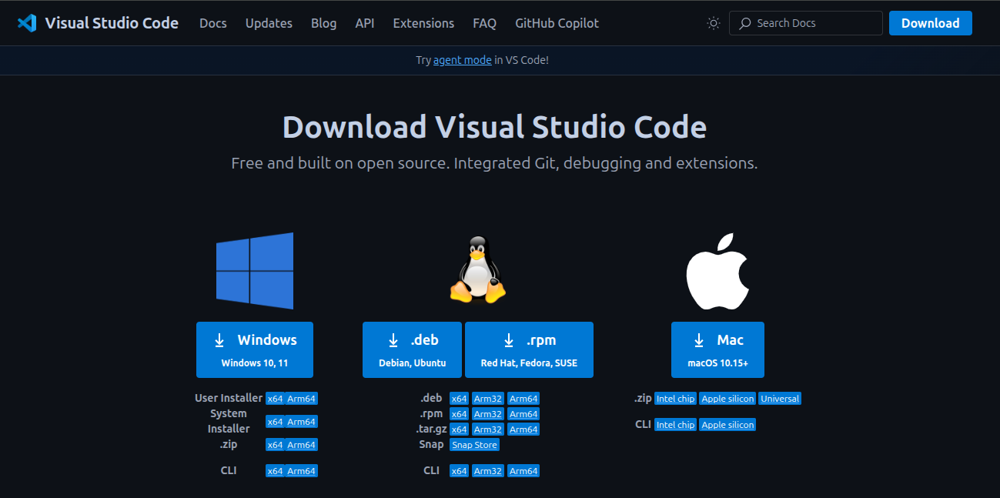
</p>

---

### Install Python Extension in VS Code

> 📦 **Step 2:** Open **VS Code**
<p>
  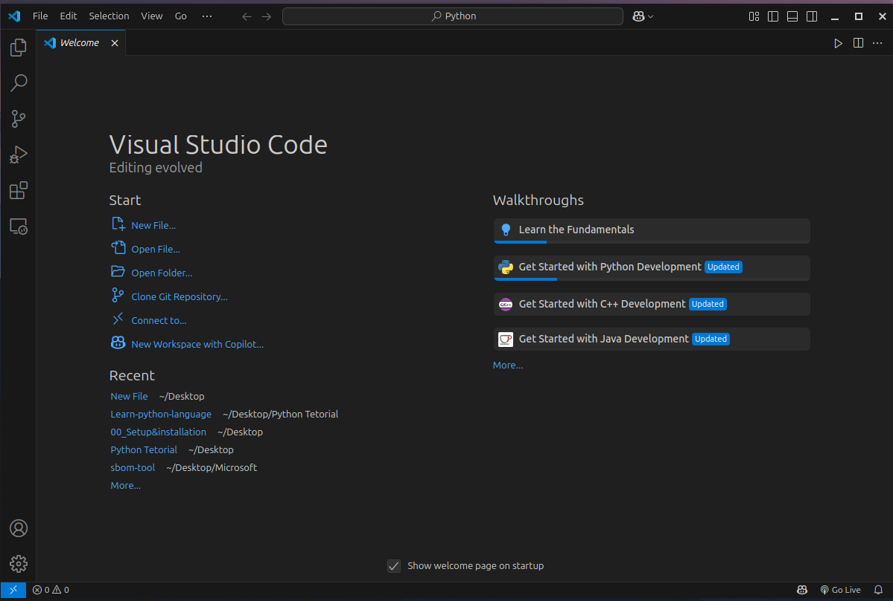
</p>

> 📦 **Step 3:** Go to the **Extensions** tab on the left sidebar or press `Ctrl+Shift+X`
<p>
  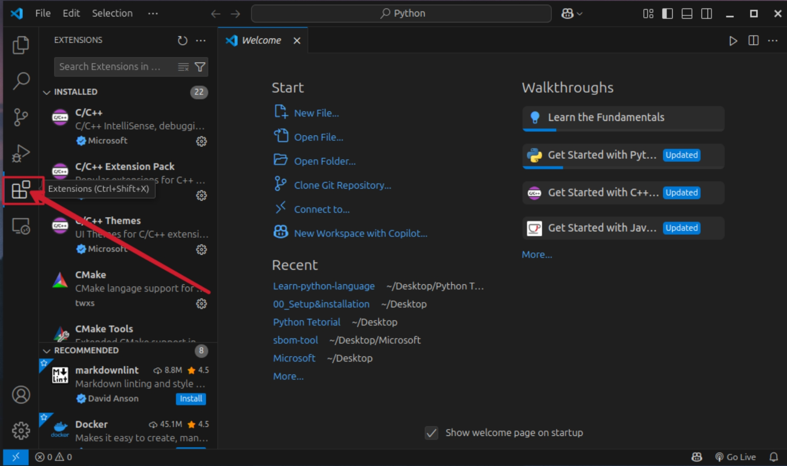
</p>


> 📦 **Step 4:** Search for "**Python**" by Microsoft and click **Install**

<p>
  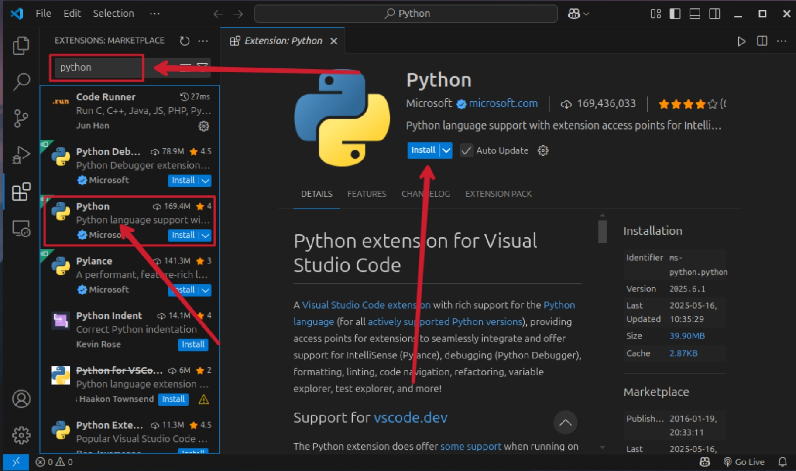
</p>


> 📦 **Step 5:** Check Python Installation
*  Go to `Terminal > New Terminal`

<p>
  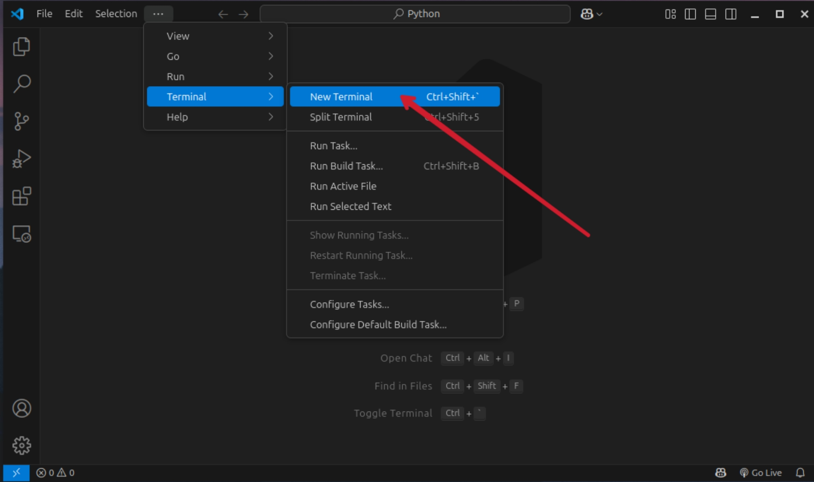
</p>

> 📦 **Step 6:** Type the following **command:**

```bash
python3 --version
python3 -V
```
<p>
  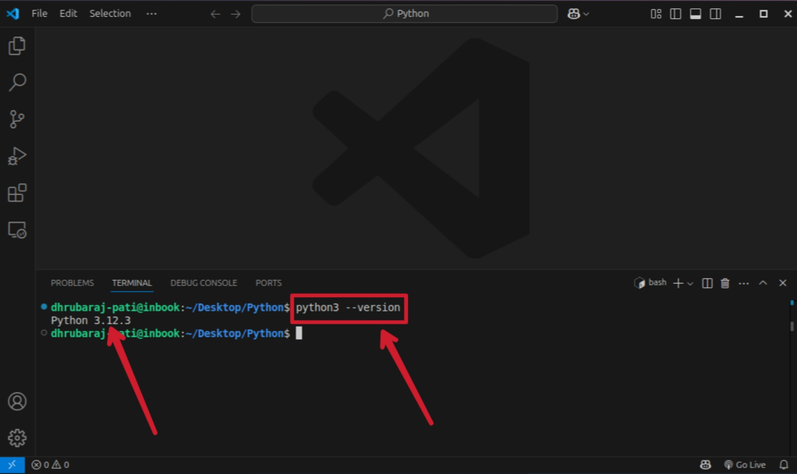
</p>

If you see something like `Python 3.x.x`, you're good to go!

---

### Create a Python File

> 1. Click on **File > Open Folder**

<p>
  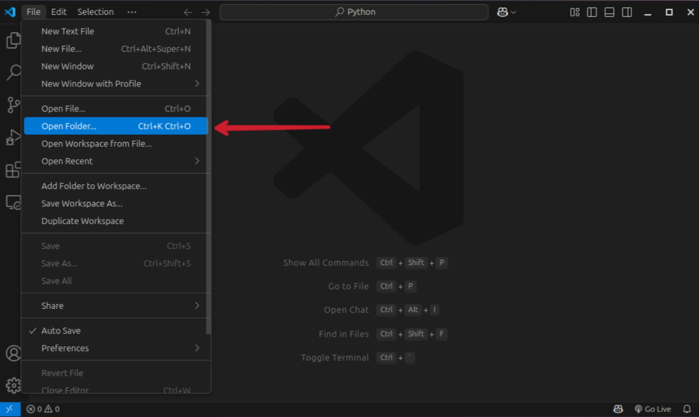
</p>

> 2. **Select Folder & Create Folder**

<p>
  
</p>

> 3. Save the file with `.py` extension (e.g., `hello.py`)

<p>
  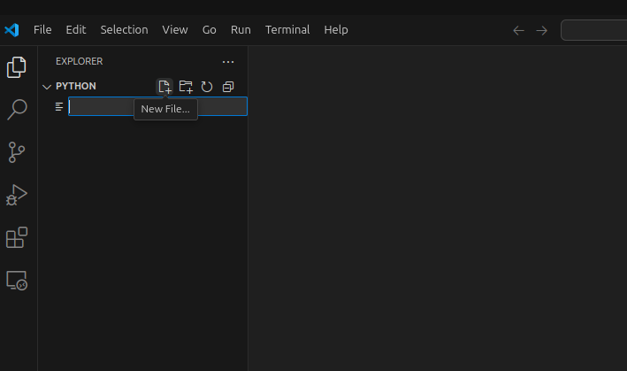
</p>

> 4. Type a simple Python script:

```python
print("Hello, VS Code!")
```
<p>
  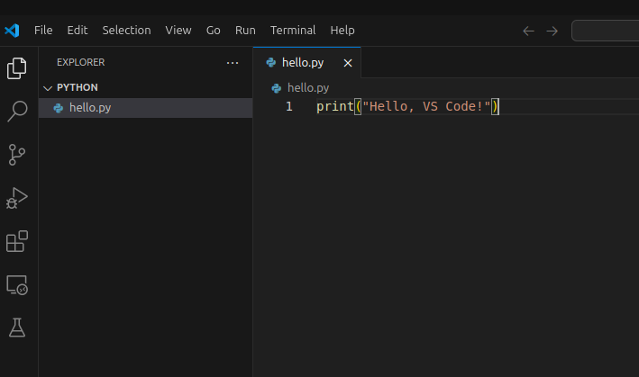
</p>


### Run Python Code in VS Code

> 5. Click on the **Run Python File** button at the top right (▶️)

<p>
  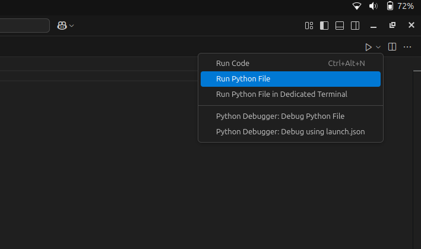
</p>

> 6. Or right-click inside the file and choose **Run Python File in Terminal**

<p>
  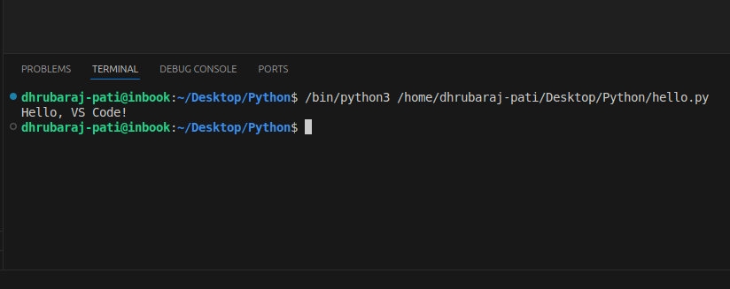
</p>

---

### 🎉 Done!

You have successfully set up Python in Visual Studio Code and are ready to start coding!